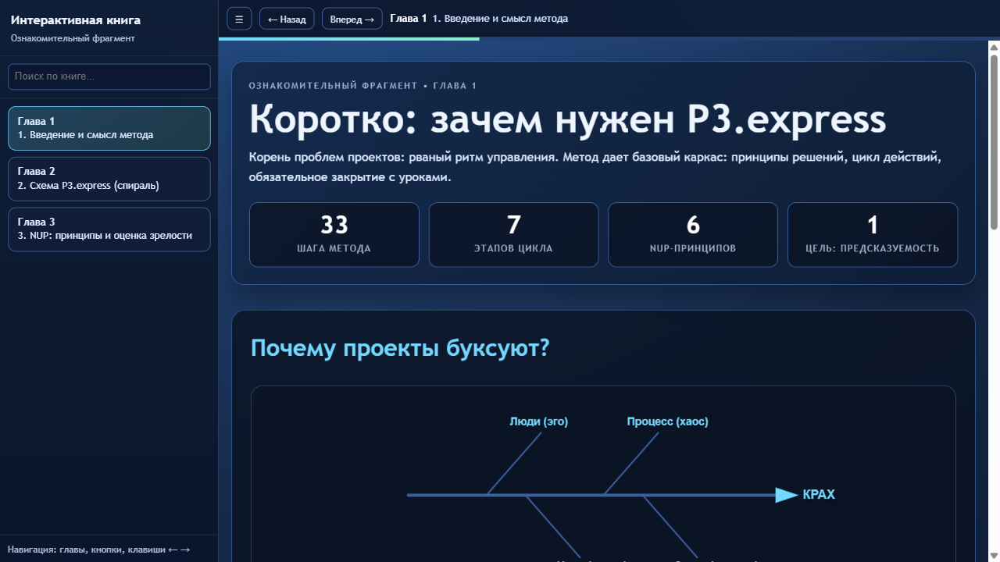
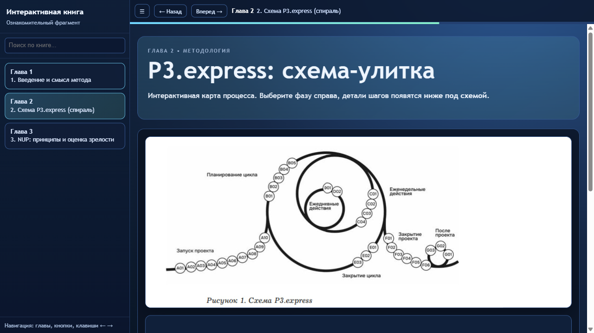
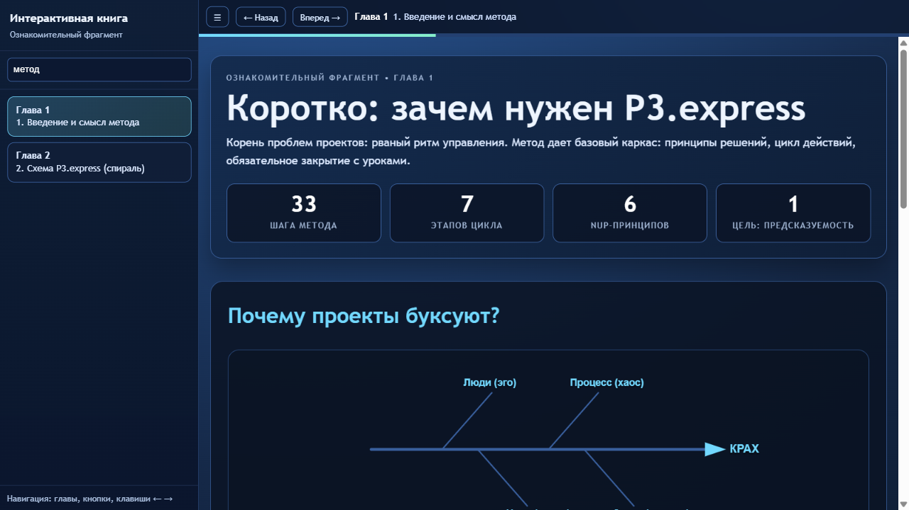
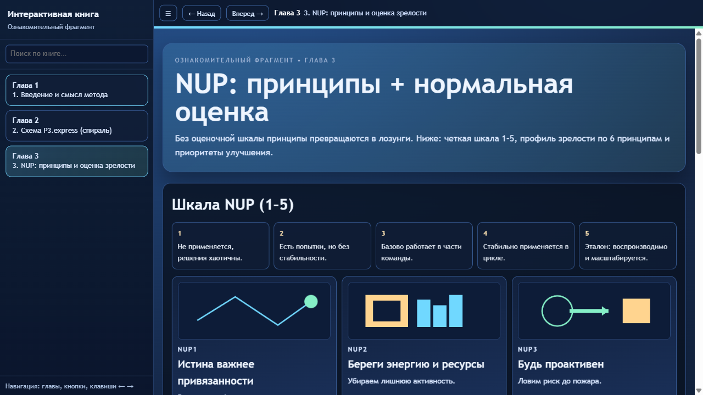

# HTML Book Bundler v9.0 "Director's Cut"

[](skills/html-book-bundler/LICENSE)

**HTML Book Bundler** is an autonomous, high-fidelity production pipeline designed to transform raw manuscripts (PDF, EPUB, FB2, DOCX) into interactive, offline-first reading applications. It delivers a **single, dependency-free HTML bundle** that functions 100% without a server or internet connection.

---

## 🎨 Visual Showcase

| Interactive Hero Section | Semantic Component Enrichment |
| :---: | :---: |
|  |  |

| Lightning Fast Search | Adaptive Dark Mode |
| :---: | :---: |
|  |  |

---

## 👨‍💻 User Guide (Human-Centric)

### What is a "Masterpiece" Book?
Traditional e-books are static. An HTML Masterpiece is a portable web application. It feels "alive" with animations, smart navigation, and interactive elements, yet it remains a simple local file you can share, archive, or read in a browser without any setup.

### Core Features:
*   **100% Offline-First:** No CDNs, no external fonts, no tracking. Privacy by design.
*   **Autonomous Enrichment:** Automatically transforms lists into stats-cards, technical blocks into formula-cards, and long prose into interactive spoilers.
*   **Professional Search:** Built-in inverted index (`SIDX`) for instant, prefix-matching search across the entire book.
*   **Mobile-First Engineering:** 2MB intelligent chunking prevents mobile Safari memory crashes on large books.
*   **Theme Engine:** Seamless switching between Light and Dark modes with zero flash of unstyled content.

### Getting Started:
1.  **Install:** `npm install` inside `skills/html-book-bundler/`.
2.  **Prepare:** Place your chapter HTML files in a folder.
3.  **Build:**
    ```bash
    node skills/html-book-bundler/scripts/bundle.cjs --input ./chapters --output Book.html --title "My Masterpiece"
    ```

---

## 🤖 AI Skill Definition (Agent-Centric Workflow)

This repository follows the **Open Skill** standard for agentic workflows. It is designed to be managed by AI Agents to perform high-stakes content production.

### Role-Based Pipeline (The Four Horsemen)
1.  **Ingester:** Deep-cleans manuscripts, removes PDF noise, and maps topology.
2.  **Architect:** Plans semantic distillation and visual storyboarding.
3.  **Designer:** Performs AST-based enrichment using `chapter_processor.cjs`.
4.  **Assembler:** Final bundling, MD5 deduplication, and Playwright-based audit.

### Technical Mandates (The Quality Manifesto)
*   **Rule 70/30:** At least 70% of flow must be structured/visual components; max 30% plain prose.
*   **Zero Hex Colors:** Only CSS variables allowed (`--bg`, `--acc`) for theme integrity.
*   **Sandbox Security:** Content runs in `iframe.srcdoc` with strict `sandbox="allow-scripts"`.
*   **Communication:** Shell-to-Chapter interaction via robust `postMessage` protocol.

### Execution Loop:
```bash
# 1. Ingest
python skills/html-book-bundler/scripts/ingest.py --input "manuscript.epub" --output ./chapters
# 2. Design & Enrich
# AI uses chapter_processor.cjs to wrap prose in components.
# 3. Final Assembly
node skills/html-book-bundler/scripts/bundle.cjs --input ./chapters --output masterpiece.html
```

---

## 🏗 Project Structure
*   `skills/html-book-bundler/` — Main engine and sub-agent instructions.
*   `scripts/` — Bundler, Ingesters, and Linters.
*   `templates/` — Production-ready interactive shell (`default.html`).
*   `lang/` — i18n support for UI and search stop-words.

## 📜 License
Licensed under the [MIT License](skills/html-book-bundler/LICENSE).

---
*Standardized for Skill Bundle v9.0. Last updated April 22, 2026.*
